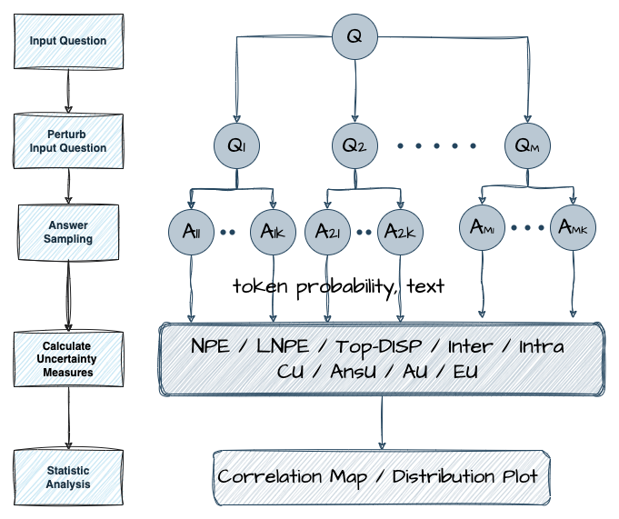
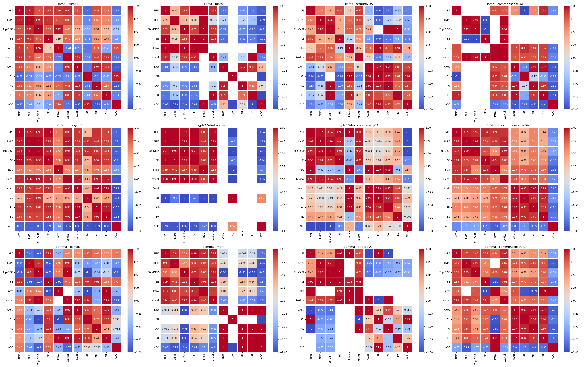

# Benchmarking Uncertainty Metrics for LLM Sampling-based Search
Sampling-based search methods, such as Chain of Thought (CoT) and Tree of Thought (ToT), improve reasoning through single- or multi-step processes. These methods can be improved by search algorithms like MCTS and Bandit, which depend on accurate uncertainty estimation. However, existing LLM uncertainty metrics, focused on token-level likelihoods or verbalized confidence, don’t fully address the needs of search tasks. In this work, we introduce four types of uncertainties crucial for search and propose a benchmarking pipeline to evaluate how current metrics quantifies these uncertainties in serach scenarios. Our experiments show that current uncertainty metrics perform inconsistently across different models and tasks, emphasizing further research for optimization-aware metrics tailored to search scenarios.

## How to Run
1. First `cd <folder>`.
2. Run `inference.py` to generate benchmarking trees for each question. Token-logprobs and text will be saved in the answer nodes of each tree.
2. Run `calculate_uncertainty.py` to calculate uncertainty metrics (NPE, LNPE, Semantic-Entropy, Top-Disp, VerbConf, lexical-similarity) and target uncertainty values (AnsU, CU, AU, EU) for each tree.
3. Run `eval_uncertainty.py` to calculate correlation between uncertainty metrics and target uncertainties. Output dataframes: mean_correlation, percentile_correlation(2.5,97.5), p-value

