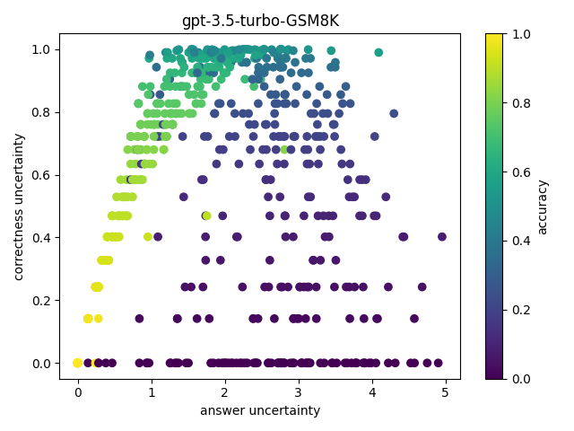

# Benchmarking Large Language Model Uncertainty for Prompt Optimization
Prompt optimization algorithms for Large Language Models (LLMs) excel in multi-step reasoning but still lack effective uncertainty estimation. This paper introduces a benchmark dataset to evaluate uncertainty metrics, focusing on Answer, Correctness, Aleatoric, and Epistemic Uncertainty. Through analysis of models like GPT-3.5-Turbo and Meta-Llama-3.1-8B-Instruct, we show that current metrics align more with Answer Uncertainty,
which reflects output confidence and diversity,rather than Correctness Uncertainty, highlighting the need for improved metrics that are optimization-objective-aware to better guide prompt optimization.

*Figure 1: A reliable uncertainty quantification metric targeting correctness in a binary classification problem exhibits 50% accuracy when uncertainty is at its highest. In contrast, most existing uncertainty quantification metrics are designed to capture confidence (diversity) and fail to be sufficient for prompt optimization tasks.*

*Figure 2: The benchmark dataset evaluates the uncertainty of prompt optimization for multi-step reasoning. The construction workflow consists of three steps for each level:  
1. Randomly perturb the input question  
2. Randomly sample model output using temperature  
3. Calculate uncertainty using different metrics*

## Version Information
- **v0**: Single-step reasoning + question perturbation + answer sampling / Metrics: NPE, LNPE, Top-DISP, Intra  
- **v1**: Multi-step reasoning + answer sampling / Metrics: NPE, LNPE, Top-DISP  
- **v2**: Multi-step reasoning + question perturbation + answer sampling / Metrics: NPE, LNPE, Top-DISP  

## Instructions for Each Task
1. Run `inference.py` to generate tree structure instances.
2. Run `calculate_uncertainty.py` to calculate uncertainty metrics for each tree instance and generate the benchmark dataset.
3. Run `eval_uncertainty.py` to generate a dataframe containing uncertainty metrics and ground truth uncertainty for all tree instances.

### Additional Scripts
- Use `hard_qs.py` to select difficult questions based on reasoning and decomposition steps.
- Download Bechmark Datasets (the output trees) using `benchmark_trees_download.sh`

## References
The structure and certain functions in this project were inspired by [llm-reasoner](https://github.com/maitrix-org/llm-reasoners), created by [Ber666].
