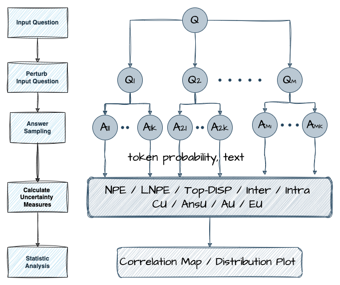
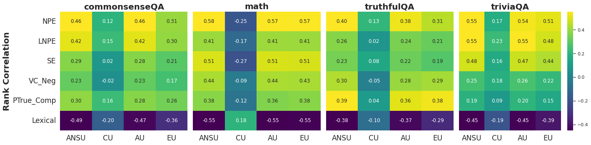

# Benchmarking Uncertainty Metrics for LLM Target-Aware Search
LLM search methods, such as Chain of Thought (CoT) and Tree of Thought (ToT), enhance LLM reasoning by exploring multiple reasoning paths. When combined with search algorithms like MCTS and Bandit methods, their effectiveness relies heavily on uncertainty estimation to prioritize paths that align with specific search objectives. \emph{However, it remains unclear whether existing LLM uncertainty metrics adequately capture the diverse types of uncertainty required to guide different search objectives.}
In this work, we introduce a framework for target-aware uncertainty benchmarking, identifying four distinct uncertainty types: Answer, Correctness, Aleatoric, and Epistemic Uncertainty. Each type serves different optimization goals in search. Our experiments demonstrate that current metrics often align with only a subset of these uncertainty types, limiting their effectiveness for objective-aligned search in some cases. These findings highlight the need for additional search-aware uncertainty estimators that can adapt to various optimization goals in LLM search. 




## How to Run

---
#### Generate benchmarking trees for each question. Token-logprobs and text will be saved in the answer nodes of each tree.
```bash
bash generate_estimator_tree.sh
```

---
#### Calculate uncertainty metrics and target uncertainty values for each tree.
```bash
bash calculate_uncertainty_estimate.sh
```

---
#### Evaluate dependencies between uncertainty metrics and target uncertainties
```bash
bash eval_estimator_dependency.sh
bash eval_correctness_dependency.sh
```


